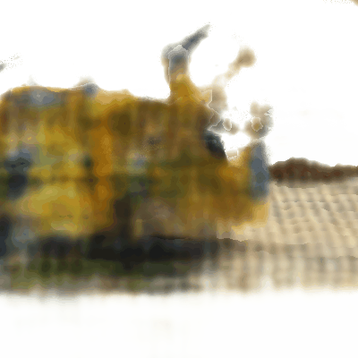

# Custom-NeRF-Engine
The repo contains an  implementation of a View-Dependent,Hierarchical Sampling,Neural Radiance Field (NeRF) engine, built from first principles. Features a custom dynamic 'Visual Hull' sampling heuristic ,replacing standard Inverse Transform Sampling. 

 
 

